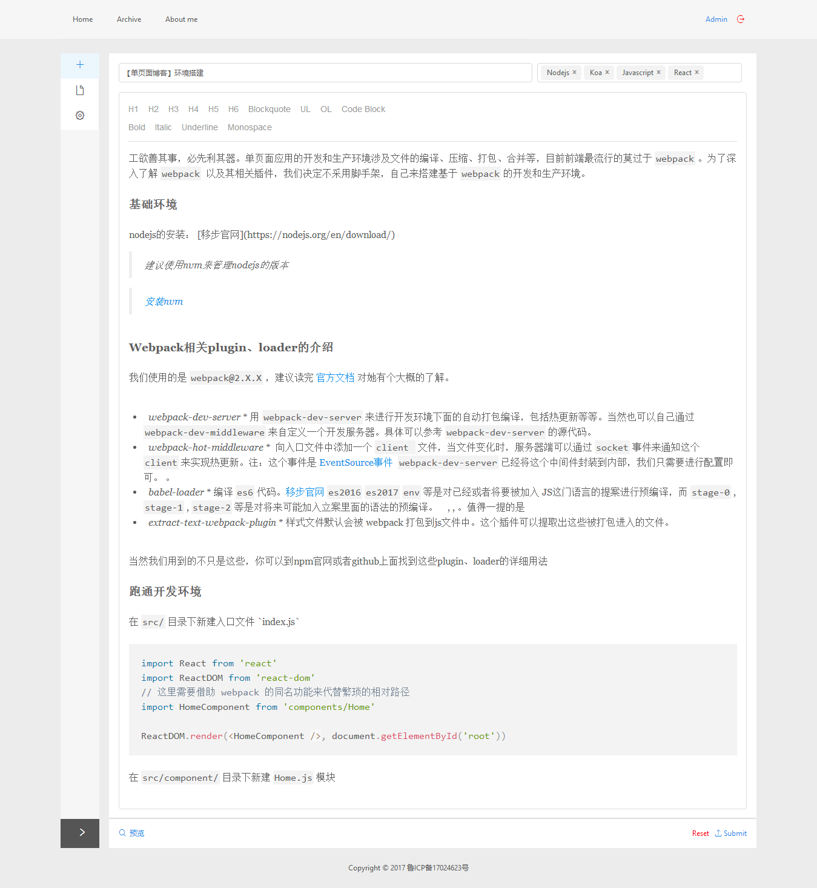

# Full-Stack-Blog 

## 演示 
[立即前往](http://codingbro.cn)
测试账号：`{username: 'test', password: 'test'}`

## 技术栈
- Koa@2 + MongoDb + Passport 组织后端逻辑
- React + Dva + Antd 结合实现单页应用
- Draftjs 可视化编辑
- webpack-dev-server 搭建开发环境
- pm2 自动部署



## 环境准备
```
node.js 7.0+
mognodb 3.0+
```

## 启动方法
```
npm install
npm run server
npm start
```

## 文章列表 

- [description](./doc/description.md)

- [【单页面博客从前端到后端】环境搭建](https://github.com/whistleyz/full-stack-blog-doc/blob/master/doc/1.%20Environment.md)

- [【单页面博客从前端到后端】基于 DVA+ANTD 搭建博客前后台界面](https://github.com/whistleyz/full-stack-blog-doc/tree/master/doc)

- [【单页面博客从前端到后端】基于 Passport 和 Koa@2 的权限验证与 DVA 的 Model 设计](https://github.com/whistleyz/full-stack-blog-doc/blob/master/doc/3.%20koa%20%2B%20passport%20%3D%20auth.md)