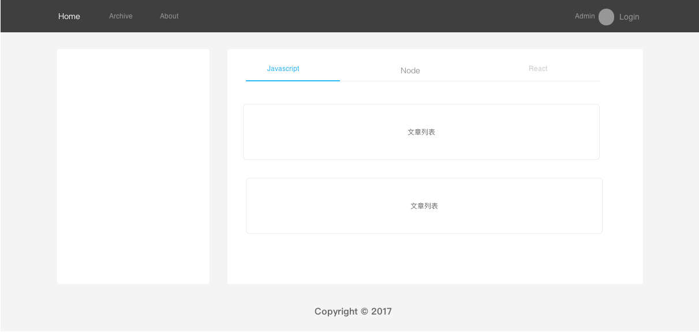

在上篇文章我们已经搭建好了基础的开发环境，接下来会介绍如何引入 DVA 和 ANTD ，以及在引入过程中需要注意的问题。这里只会详细的书写部分组件，其他的组件都是大同小异。你可以在 [github仓库](https://github.com/whistleyz/full-stack-blog-doc) 中找到这些组件。

### 博客的原型图

这里我简单的画了一个博客的轮廓图。这样在写组件的过程中有助于有个整体性的思路，不迷路…



### 添加目录结构

```sh
blog 
├─ dist           # 输出目录
├─ task           # 这里来放webpack处理和配置文件
├─ src
|  ├─ assets      # 静态文件文件夹
|  ├─ components  # 组件
|  |  ├─ Home     # Home 页面的文件夹
|  |  ├─ Archive 
|  |  ├─ About
|  |  ├─ Admin    # 后台界面文件夹
|  |  ├─ Header.js    # 公共的 Header 组件
|  |  ├─ Footer.js    # 公共的 Footer 组件
|  |  ├─ UserCard.js  # 公共的 UserCard 组件
|  |  ├─ Login.js     # 公共的 Login 组件
|  ├─ containers  # Redux 的容器组件
|  |  ├─ Home.js      # Home 组件的容器
|  |  ├─ Archive.js
|  |  ├─ About.js
|  |  ├─ Admin        # 后台各界面的容器文件夹
|  ├─ router.js   # React 路由
|  └ index.js     # 入口文件
| package.json
```

### 引入 DVA 和 ANTD

#### DVA 的简单引入

> Lightweight front-end framework based on redux, redux-saga and react-router@2.x. (Inspired by elm and choo)  

要知道 `dva` 是对 `redux` , `redux-saga` , `react-router` 的封装，使用上有点像 `express.js` ，那么你就要多少对他们有所了解，`dva` 的 [github 仓库](https://github.com/dvajs/dva) 有详细的入门指南、概念和示例，可以先去了解一下 。

更改入口文件 `src/index.js` 

```js
import dva from 'dva'
const app = dva()

app.router(require('./router'))
app.start('#root')
```

新建路由文件 `src/router.js`

```js
import React from 'react'
import { Router, Route, IndexRoute, IndexRedirect } from 'dva/router'

import AppLayout from './container/App'
import Home from './container/Home'
import Archive from './container/Archive'
import About from './container/About'
import Article from './container/Article'
import AdminArticles from './container/Admin/Articles'
import AdminKeywrods from './container/Admin/Keywords'
import AdminEditor from './container/Admin/Editor'
import AdminLayout from './container/Admin/Admin'

export default ({history, app}) => {
    return (
        <Router history={history}>
            <Route path="/" component={AppLayout}>
                <IndexRoute component={Home} />
                <Route path="archive" component={Archive} />
                <Route path="about" component={About} />
                <Route path="article/:id" component={Article} />
                <Route path="admin" component={AdminLayout}>
                    <IndexRedirect to="articles" />
                    <Route path="articles" component={AdminArticles} />
                    <Route path="keywords" component={AdminKeywrods} />
                    <Route path="editor" component={AdminEditor} />
                </Route>
            </Route>
        </Router>
    )
}
```

从这里可以看出， `dva` 自己在内部引入 [react-router-redux](https://github.com/reactjs/react-router-redux) ，然后使用 `react-router-redux` 提供的 `combineReducers ` 把 `routerRedux` 合并到用户的 `reducers` 中

> 限于文章的篇幅，`dva` 的 `model` 的设计会放到下一次的文章来描述  

#### 引入 ANTD

**按需加载**

在引入 `ANTD` 之前，我们先来实现 `按需加载` 。其实概念很简单，就是我们在引入一个样式库的时候，往往只会用到这个样式库的部分组件，但是工具会把整个组件库都打包到我们的项目中，这是我们不想看到的。`按需加载` 就是用来打包我们引入的组件，可以使用 [babel-plugin-import](https://github.com/ant-design/babel-plugin-import) 来具体实现。

在 `task/config.js` 的 `babel-loader` 的 plugins 配置中添加: 
`["import", { "libraryName": "antd", "style": true }]` 

**自定义主题**

由脚手架 [atool-build](https://github.com/ant-tool/atool-build/blob/master/src/getWebpackCommonConfig.js#L145) 和 [官网介绍](https://ant.design/docs/react/customize-theme-cn)，我们已经自己配置并新建好了主题文件 `theme.js` 。

**添加 less-loader 处理样式文件**

上节我们只是添加了对 `.module.less` 文件进行编译，在自定义主题时，需要对 less 变量进行覆盖，所以要求 `babel-plugin-import` 的 `style` 选项设置为 `true` ，让它导出 `antd` 组件的 `.less` 样式文件才能进行变量覆盖操作。

在 `task/config.js` 中 `module.rules` 追加

```js
{
    test: function(path){
        return /\.less$/.test(path) && !/\.module\.less$/.test(path)
    },
    loader: ExtractTextPlugin.extract({
        fallback: 'style-loader', 
        use: [
            {
                loader: 'css-loader', 
            },
            {
                loader: 'postcss-loader',
                options: {
                    plugins: postcssPlugins
                }
            },
            {
                loader: 'less-loader', 
                options: {"modifyVars": theme}
            }
        ]
    })
},
```

注意 `/\.less/` 至少会匹配到 `.module.less` 和 `.less` 文件，所以要排除 `.module.less` ，因为它需要被 `css-module` 处理。

你也可能会通过添加 `exclude` ,  `include` 来对样式库中的 `less` 文件和自己编写的文件进行区别，毕竟样式库肯定都是从 `node_modules` 目录中加载，而自己的是从 `src` 目录下加载的。也正因为样式库是从 `node_modules` 目录下加载的，所以这样做可能会导致降低 `webpack` 的编译速度。

### 添加容器组件和展示组件

#### 容器组件

在 `/src/containers` 下新建 `App.js`

```js
import React, { PropTypes } from 'react'
import { connect } from 'dva'
import { Layout, Menu, Breadcrumb, Row, Col, Icon } from 'antd'
import HeaderComponent from 'components/Header'
import FooterComponent from 'components/Footer'
import LoginModel from 'components/Login'
const { Header, Content, Footer } = Layout

const App = ({children, routes}) => {
    return (
        <Layout>
            <Header>
                <HeaderComponent routes={routes}>
                    <LoginModel doLogin={() => {}} />
                </HeaderComponent>
            </Header>
            <Content style={{ margin: '24px 100px 0', background: '#fff', minHeight: 280, overflow: 'hidden' }}>
                {children}
            </Content>
            <Footer>
                <FooterComponent />
            </Footer>
        </Layout>
    )
}

export default connect()(App)
```

因为 `dva` 封装了 `redux` ， [源文件](https://github.com/dvajs/dva/blob/master/index.js) 中也是直接导出 `react-redux` 的 `connect` 方法。所以在创建容器组件的时候还是等同于 `react-redux` 。

> 注意，这个 App组件是作为子路由组件的父组件，即 `children ` 代表的就是那些子组件 `Home` , `Archive` …  

其他的展示组件，即 `/src/containers` 文件夹下面的组件，都是大同小异，就不一一赘述。

#### 展示组件

我们看到 `src/container/App.js` 展示组件，引入了一个 `HeaderComponent` ，在 `src/components` 下面新建一个 `Header.js`

```js
import React from 'react'
import { Layout, Menu, Breadcrumb, Row, Col } from 'antd'
import { Router, Link } from 'dva/router'

const HeaderComponent = (props) => {
    const { children, routes } = props
    const routePath = (routes[routes.length - 1] || {}).path || '/'
    return (
        <div>
            <Row>
                <Col span={16}>
                    <Menu
                        mode="horizontal"
                        defaultSelectedKeys={[routePath]}
                        style={{ lineHeight: '64px', backgroundColor: 'transparent' }}
                    >
                        <Menu.Item key="/"><Link to="/">Home</Link></Menu.Item>
                        <Menu.Item key="archive"><Link to="archive">Archive</Link></Menu.Item>
                        <Menu.Item key="about"><Link to="about">About me</Link></Menu.Item>
                    </Menu>
                </Col>
                <Col span={8}>
                    <div style={{ lineHeight: '64px', float: 'right', padding: '0 20px' }}>
                        {children}
                    </div>
                </Col>
            </Row>
        </div>
    )
}

export default HeaderComponent
```

这就是个普通的 React 的展示组件没什么好说的，这些组件可以直接在 `Antd` 的官网上找到用法，而且都有示例代码。

`const routePath = (routes[routes.length - 1] || {}).path || '/'`
找到路由路径中的最后一个名称，如 `/home` 中的 `home` ，作为 `Menu` 的默认选中项，这样在当前页面刷新，就可以让当前页面对应的导航高亮。

其他的展示型组件也都是大同小异，你可以在 [github仓库](https://github.com/whistleyz/full-stack-blog-doc)  中找到它们的实现。

### 引入 url-loader 来处理文件路径

在 `task/config.js` 中的 `module.rules` 追加：

```js
{
    test: /\.(png|jpe?g|gif|svg)(\?.*)?$/,
    loader: 'url-loader',
    options: {
        limit: 10000,
        name: 'img/[name].[hash:7].[ext]'
    }
},
{
    test: /\.(woff2?|eot|ttf|otf)(\?.*)?$/,
    loader: 'url-loader',
    options: {
        limit: 10000,
        name: 'fonts/[name].[hash:7].[ext]'
    }
},
```

关于 `url-loader` 的配置方法，可以在 `webpack` 的文档中查看

### 小结

这篇文章主要是引入了两个重要的库 `dva` 和 `antd` ，以及编写部分展示组件。接下来，我们会对 `dva` 的数据层，已经后台初步搭建，同步进行前后端的开发。

